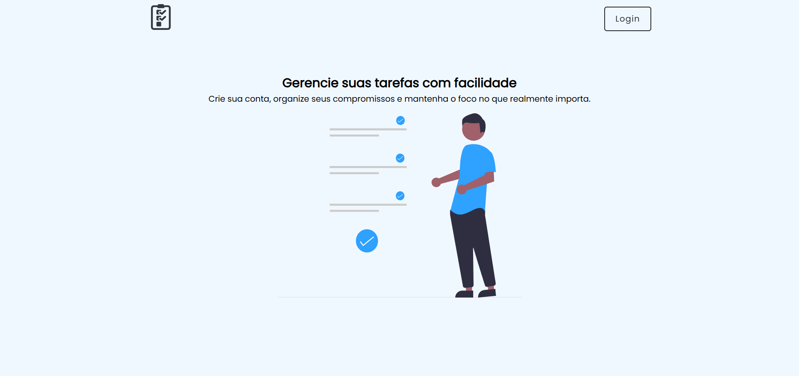
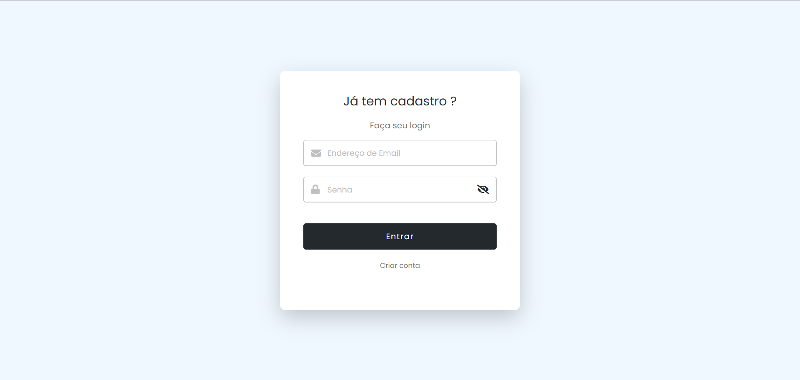
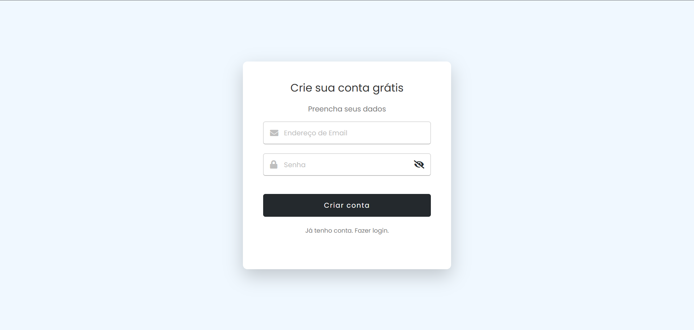
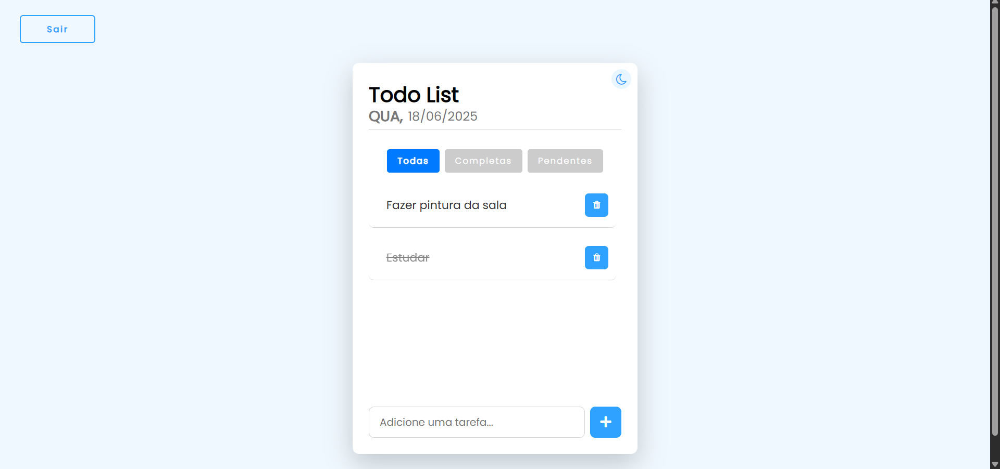
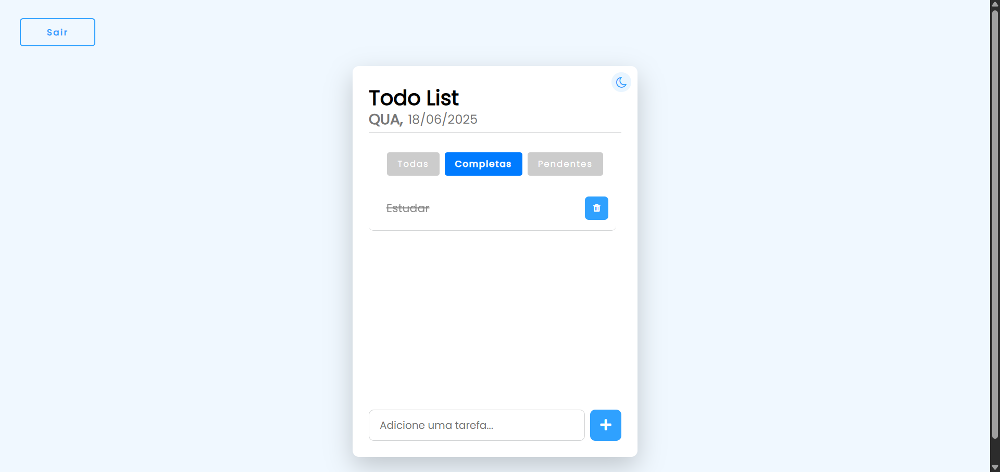
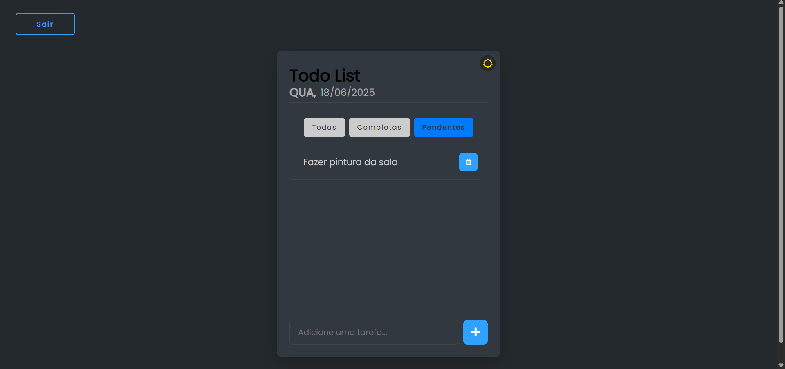

# 📝 Todo List Fullstack App

Este é um aplicativo completo de Lista de Tarefas (Todo List), com backend em **Node.js + Express + Prisma** e frontend em **HTML/CSS/JavaScript puro**. Ele permite criar, listar, concluir e deletar tarefas de forma autenticada.

## 🚀 Funcionalidades

- ✅ Criar tarefas
- 📋 Listar todas as tarefas do usuário
- 🔁 Marcar tarefas como concluídas/incompletas
- ✏️ Editar o título das tarefas
- ❌ Deletar tarefas
- 🔐 Autenticação com JWT
- 🌙 Tema claro/escuro

## 🛠️ Tecnologias Utilizadas

### 🔙 Backend
- Node.js + Express
- TypeScript
- Prisma ORM (com MongoDB)
- JWT para autenticação
- Zod para validação
- CORS + dotenv

### 🔝 Frontend
- HTML5 / CSS3
- JavaScript puro (sem frameworks)
- FontAwesome
- SweetAlert2
- LocalStorage (para token, userId e tema)

## 🧑‍💻 Como Executar o Projeto

### 📦 1. Clonar o projeto
```bash
git clone https://github.com/jefferson-gbarbosa/todo-list.git
cd todo-list
```

### 📁 2. Instalar dependências do backend
```bash
cd backend
npm install
```

### ⚙️ 3. Configurar variáveis de ambiente
Crie um `.env` com:

```env
DATABASE_URL=<sua-url-do-banco>
JWT_SECRET=segredo_seguro
PORT=3000
```

### 🧪 4. Rodar as migrations (Prisma)
```bash
npx prisma generate
npx prisma db push
```

### ▶️ 5. Iniciar o servidor backend
```bash
npm run dev
```

O backend estará em `http://localhost:3000`

### 🌐 6. Rodar o frontend

Abra o arquivo:

```bash
frontend/index.html
```
ou use uma extensão como "Live Server" no VSCode.

## 📤 API Endpoints

### 🔐 Autenticação

- `POST /api/sign-up` – Cria um novo usuário  
- `POST /api/sign-in` – Retorna JWT + userId

### 📌 Tarefas

- `GET /api/tasks?userId=${userId}&sortBy=createdAt`
- `POST /api/create-tasks` – Cria nova tarefa
- `PUT /api/tasks/:id` – Atualiza o título (`title`) ou o status (`completed`) da tarefa
- `DELETE /api/tasks/:id` – Remove tarefa

## 📸 Telas do Projeto









## 🔒 Observações de Segurança

- As ações de atualizar e deletar tarefas requerem um token JWT no `Authorization: Bearer <token>`.
- A criação e listagem de tarefas não exigem token, mas usam `userId`.

## 📚 Licença

Este projeto está sob a licença MIT.

## 👨‍💻 Autor

- Linkedin - [jefferson-gbarbosa](https://www.linkedin.com/in/jefferson-gbarbosa/)